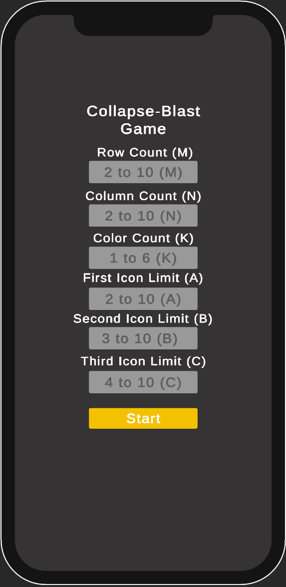
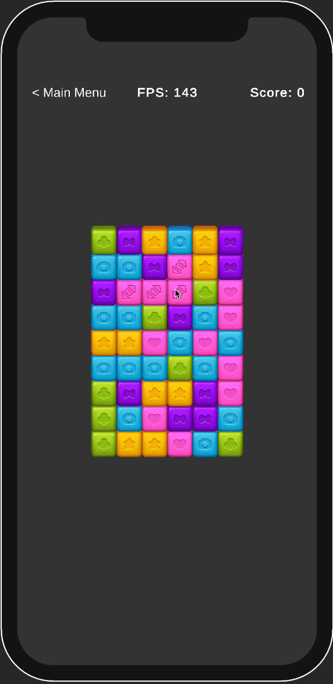

# 🎮 Tile-Matching Blast Game (Collapse Mechanic) 🚀

## 📌 Project Description
This project is a **tile-matching and blast-based Unity 2D game** where players tap on matching blocks to clear the board. The game focuses on **performance optimization**, particularly in **memory, CPU, and GPU efficiency**.

---

## 🎯 **Features**
✅ **Tile-Blasting Mechanic:** Players can blast at least **two adjacent blocks** of the same color.  
✅ **Dynamic Block Falling:** Destroyed blocks are replaced by falling new ones from above.  
✅ **Grid Generation:** Board size ranges from **2x2 to 10x10**.  
✅ **Color & Icon Variation:** **1 to 6 different block colors** with changing icons based on group size.  
✅ **Deadlock Detection & Shuffle:** The game detects when no moves are left and **smartly shuffles** the board.  
✅ **Performance Optimization:** Efficient **memory management and GPU rendering** to ensure smooth gameplay.  

---

## 📷 **Screenshots**  

    
    

---

## 🛠 **Technologies & Tools**
| Technology | Description |
|------------|------------|
| 🎮 **Unity** | Game Engine |
| 💻 **C#** | Programming Language |
| 🎨 **Unity UI** | User Interface Components |
| 🚀 **Profiler & Debugging** | Performance Monitoring Tools |

---

## 📂 **Installation Guide**
Follow these steps to set up and run the game on your system.

### 🖥️ **1. Requirements**
- **Unity 6 version 6000.0.32f1+** installed.
- **Git** or **GitHub Desktop** installed.

### 🔧 **2. Setup Instructions**
1. **Clone the Repository**  
2. **Open in Unity**  
- Launch **Unity Editor**, go to `File > Open Project`, and select the project folder.
3. **Install Dependencies**  
- If any packages are missing, open `Window > Package Manager` and update/install them.
4. **Run the Game**  
- Press **Play** to start testing the game.

---

## ⏳ **Gameplay Mechanics**
- Players **tap on groups of matching tiles** to remove them.
- **Blocks fall down** from above to fill empty spaces.
- If there are **no available moves**, the game **shuffles the board automatically**.
- On every shuffle, the table have **at least one possible move** thanks to the **smart shuffle algorithm**.
- **Icons change based on group size**:
- **Less than A →** Default icon.
- **Between A and B →** First icon.
- **Between B and C →** Second icon.
- **More than C →** Third icon.

---

## 🔍 **Performance Testing**
✅ **Profiler Analysis:** CPU, GPU, and memory optimizations via **Unity Profiler**.  
✅ **FPS Counter:** Added a **real-time FPS display** for performance monitoring.  
✅ **Draw Call Optimization:** Used **Sprite Atlas** to reduce GPU load.  
✅ **Memory Profiler:** Minimized **garbage collection** for smoother performance.  

---

## 📞 **Contact & Support**
📧 **Email:** `krktbunyamin@gmail.com`
📌 **LinkedIn:** [@bnymnkrkt](https://www.linkedin.com/in/bnymnkrkt/)

